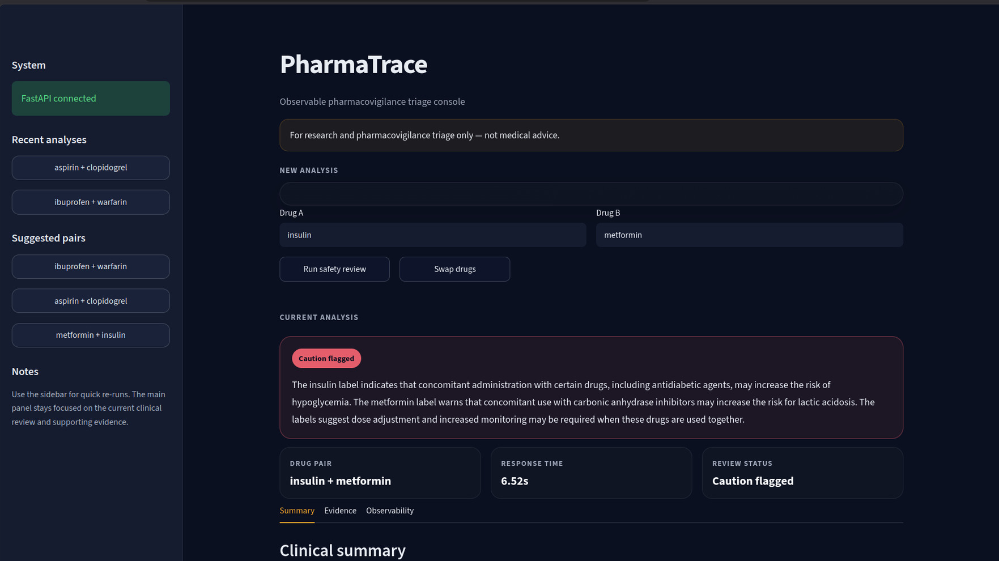
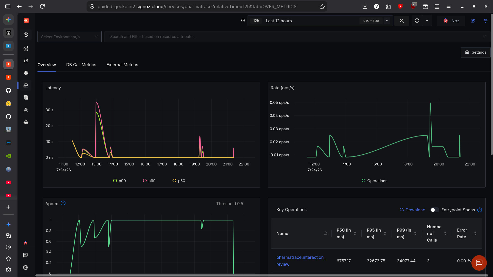
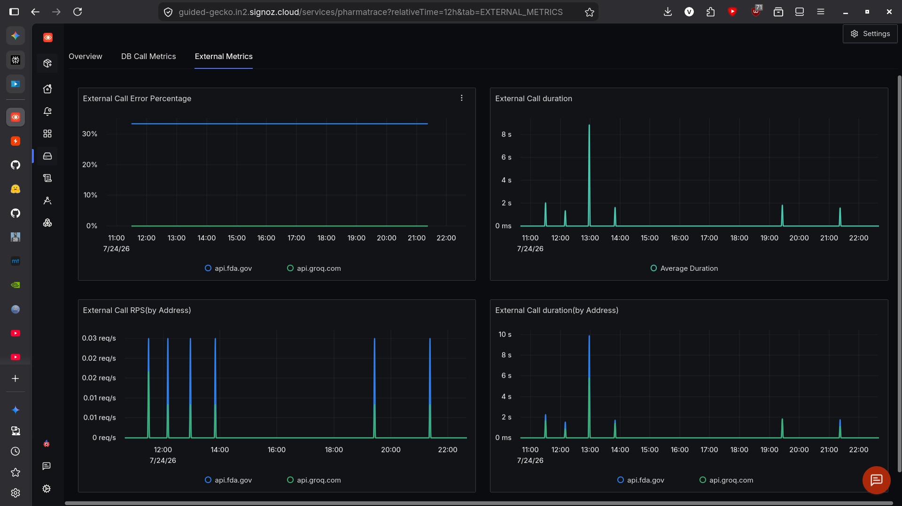
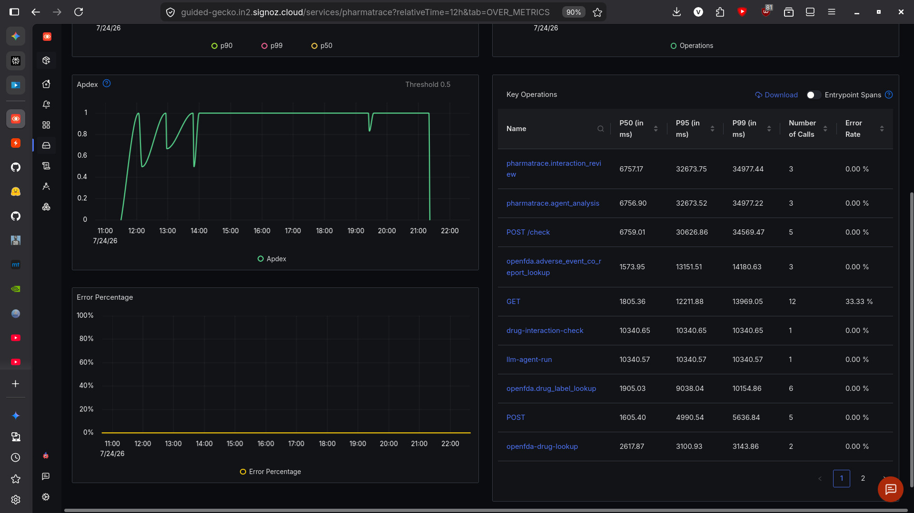

# 🔬 PharmaTrace

> **An observable pharmacovigilance triage assistant grounded in live FDA evidence.**

PharmaTrace is an AI-assisted drug interaction review tool built for the **Agents of SigNoz Hackathon 2026**. It combines live evidence retrieval from **OpenFDA**, structured LLM synthesis with **Groq**, and end-to-end tracing with **OpenTelemetry + SigNoz** so each review request is not only generated, but also observable and debuggable.

Unlike a generic chatbot, PharmaTrace does not answer from model memory alone. It first retrieves current FDA label and adverse-event evidence, then uses an LLM to generate a structured review summary with explicit limitations and a clinician-review-oriented outcome.

---

## Problem

Drug interaction analysis is a high-stakes workflow. If an AI system gives a weak answer, times out, or relies on stale model memory, it becomes difficult to understand what failed and why. In healthcare-related use cases, that lack of observability is a serious trust problem.

PharmaTrace addresses this by making the whole pipeline visible:

- User query submission
- FDA label retrieval
- FAERS co-report retrieval
- LLM synthesis
- Latency and dependency behavior
- Traceable end-to-end execution in SigNoz

---

## What PharmaTrace does

A user enters two drug names in the Streamlit app. The backend validates the request, retrieves relevant FDA evidence, and produces a structured interaction review with a summary, evidence blocks, limitations, and trace metadata. The request is instrumented with OpenTelemetry so the full flow can be inspected in SigNoz.

### Output includes

- Review status such as `NEEDS_CLINICAL_REVIEW` or `CAUTION_FLAGGED`
- Clinical-style summary grounded in retrieved evidence
- Drug A warnings
- Drug B warnings
- Label interaction evidence
- FAERS co-report signal
- Safety limitations and disclaimers
- Trace-linked observability

---

## Why this project is different

Most AI demos stop at “it generated an answer.” PharmaTrace focuses on **observable, evidence-grounded generation**.

### Key differentiators

- **Live retrieval-grounded generation** using OpenFDA and FAERS
- **Structured backend contract** with FastAPI + Pydantic
- **Bounded AI behavior** focused on synthesis, not free-form clinical claims
- **SigNoz observability** for latency, rate, key operations, and external dependencies
- **Persistent frontend history** for recent analyses

This is best described as an **agentic, retrieval-grounded application** rather than a simple chatbot. It uses live evidence retrieval before generation, but it is **not vector-database RAG**. Instead, it is a practical API-grounded retrieval + generation workflow.

---

## Architecture

```text
User
  │
  ▼
Streamlit Frontend
  ├─ New analysis form
  ├─ Current analysis panel
  ├─ Evidence tabs
  └─ Recent analyses history
  │
  ▼
FastAPI Backend (/check)
  ├─ Request validation (Pydantic)
  ├─ Evidence retrieval orchestration
  │   ├─ OpenFDA drug label lookup
  │   ├─ OpenFDA / FAERS co-report lookup
  │   └─ Groq LLM summary synthesis
  ├─ Structured response contract
  └─ Review limitations and disclaimers
  │
  ▼
OpenTelemetry
  ├─ Request span
  ├─ Agent-analysis span
  ├─ FDA lookup spans
  └─ Outbound dependency telemetry
  │
  ▼
SigNoz Cloud
  ├─ Service overview
  ├─ Latency / rate / error views
  ├─ Key operations
  └─ External dependency metrics
```

---

## Tech stack

| Layer | Tools |
|---|---|
| Frontend | Streamlit |
| Backend | FastAPI, Uvicorn, Pydantic |
| LLM | Groq (`llama-3.3-70b-versatile`) |
| Retrieval | OpenFDA Drug Label API, OpenFDA Drug Event / FAERS API |
| HTTP client | `httpx`, `requests` |
| Observability | OpenTelemetry, OTLP exporter, SigNoz Cloud |
| Local persistence | JSON file for recent analyses |

---

## Screenshots

### PharmaTrace frontend



### SigNoz service overview



### SigNoz external dependency metrics



### SigNoz key operations



---

## Project structure

```text
pharmatrace/
├── assets/
│   └── screenshots/
│       ├── pharmatrace-frontend.jpg
│       ├── signoz-overview.jpg
│       ├── signoz-external-metrics.jpg
│       └── signoz-key-operations.jpg
├── backend/
│   ├── __init__.py
│   ├── main.py
│   ├── agent.py
│   ├── tools.py
│   ├── schemas.py
│   └── telemetry.py
├── frontend/
│   ├── __init__.py
│   ├── app.py
│   ├── storage.py
│   └── history.json
├── .streamlit/
│   └── config.toml
├── .env.example
├── requirements.txt
└── README.md
```

---

## API contract

### Health check

`GET /health`

Example response:

```json
{
  "status": "ok",
  "service": "pharmatrace"
}
```

### Interaction review

`POST /check`

Example request:

```json
{
  "drug_a": "ibuprofen",
  "drug_b": "warfarin"
}
```

Example response:

```json
{
  "request_id": "pt_a1b2c3d4",
  "trace_id": "7348692e8f90acffd305eb7718ca0bc1",
  "drug_a": "ibuprofen",
  "drug_b": "warfarin",
  "review_status": "NEEDS_CLINICAL_REVIEW",
  "summary": "Potential safety concerns were identified. Review label evidence.",
  "evidence": {
    "drug_a_warnings": "...",
    "drug_b_warnings": "...",
    "label_interactions": "...",
    "faers_co_report_count": 0
  },
  "limitations": [
    "For research and pharmacovigilance triage only — not medical advice.",
    "FDA adverse-event co-reports do not establish causality, incidence, or comparative safety.",
    "A qualified clinician must review patient-specific medication decisions."
  ]
}
```

---

## Observability

PharmaTrace is instrumented with OpenTelemetry so each interaction review can be inspected as a trace in SigNoz.

The current setup provides:

- Service-level latency, rate, and error visibility
- Key operation timing for backend spans
- External dependency metrics for FDA and Groq calls

### Example operations visible in SigNoz

- `pharmatrace.interaction_review`
- `pharmatrace.agent_analysis`
- `openfda.drug_label_lookup`
- `openfda.adverse_event_co_report_lookup`
- `POST /check`

This observability layer makes it possible to debug:

- Slow FDA responses
- High-latency LLM calls
- Backend failures
- Trace-level execution paths for each review

---

## Safety design

PharmaTrace is intentionally designed as a **triage assistant**, not a clinical decision-maker.

### Safety constraints

- It does **not** diagnose or prescribe
- It does **not** claim comparative safety or causality from FAERS data
- It returns structured review-oriented outcomes such as:
  - `NEEDS_CLINICAL_REVIEW`
  - `CAUTION_FLAGGED`
  - `NO_LABEL_SIGNAL_FOUND`
  - `ANALYSIS_UNAVAILABLE`
- It always includes limitations and a medical disclaimer

This matters because FDA adverse-event co-reports are observational signals and do not establish causality or incidence.

---

## How it works

1. User submits two drug names from the Streamlit app
2. FastAPI validates the request with Pydantic
3. The backend retrieves FDA label evidence for both drugs
4. The backend retrieves an adverse-event co-report signal from OpenFDA / FAERS
5. Groq synthesizes a structured summary grounded in the retrieved evidence
6. The response is returned to the frontend and rendered in summary, evidence, and observability tabs
7. OpenTelemetry exports traces and metrics to SigNoz

---

## Local persistence

The frontend stores recent analyses in a local JSON file so users can revisit previous drug pairs after refresh. This lightweight persistence model is suitable for a hackathon prototype and improves repeated evaluation workflows without requiring a full database.

---

## Setup

### 1. Clone the repository

```bash
git clone https://github.com/vishalm342/pharmatrace.git
cd pharmatrace
```

### 2. Create and activate a virtual environment

```bash
python -m venv venv
source venv/bin/activate
```

### 3. Install dependencies

```bash
pip install -r requirements.txt
```

### 4. Create `.env`

```bash
cp .env.example .env
```

Example `.env`:

```env
GROQ_API_KEY=your_groq_api_key
SIGNOZ_ENDPOINT=https://ingest.in2.signoz.cloud:443
SIGNOZ_INGESTION_KEY=your_signoz_ingestion_key
OTEL_SERVICE_NAME=pharmatrace
```

### 5. Start the backend

```bash
uvicorn backend.main:app --reload
```

### 6. Start the frontend

```bash
streamlit run frontend/app.py
```

---

## Demo flow

A good demo sequence for judges:

1. Open the PharmaTrace frontend
2. Run `ibuprofen + warfarin`
3. Show the structured summary and evidence tabs
4. Run a second pair such as `aspirin + clopidogrel`
5. Show recent analysis persistence in the sidebar
6. Open SigNoz and show:
   - Service overview
   - Key operations
   - External dependency metrics
7. Explain how observability helps debug latency and dependency failures

---

## Limitations

- This is a hackathon prototype, not a medical device
- It depends on availability and quality of OpenFDA responses
- FAERS co-report counts are not causal evidence
- Local JSON history is lightweight persistence, not multi-user storage
- Final medication decisions must be made by a qualified clinician

---

## Future improvements

- Add clinician-focused explanation templates
- Add user authentication and secure multi-user storage
- Add exportable PDF reports
- Add deployment with Docker
- Add automated tests and CI
- Add custom SigNoz alerts for latency and failure spikes
- Add deeper grounding and evidence ranking

---

## Built for

**Agents of SigNoz Hackathon 2026**  
Track: **AI & Agent Observability**

---

## Author

**Vishal M**  
GitHub: [vishalm342](https://github.com/vishalm342)